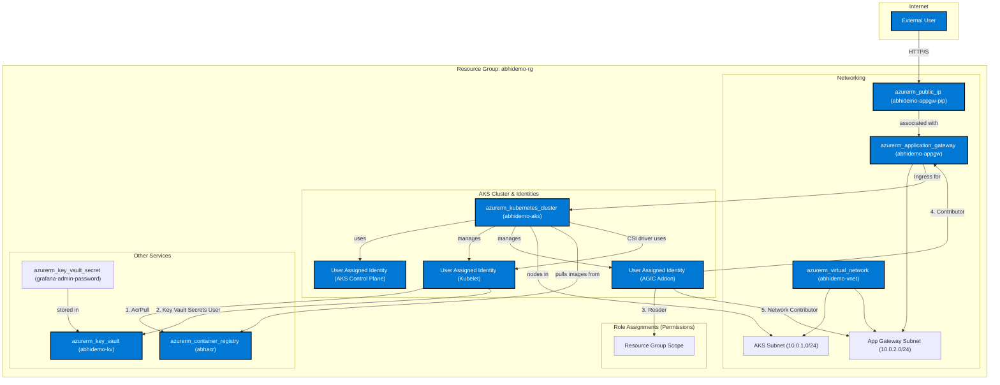

# AKS Production-like Automated Demo

## What this repo does
- Provisions Azure infra (AKS, Application Gateway, ACR).
- Configures AKS with Azure AD (Microsoft Entra) login and RBAC.
- Enables node auto-scaling for the AKS cluster.
- CI performs IaC scans with Checkov.
- CD builds images and automatically installs Helm charts:
  - OPA Gatekeeper
  - kube-prometheus-stack (Prometheus + Grafana)
  - Secrets Store CSI Driver for Azure Key Vault integration
- Exposes the demo app and Grafana dashboard via path-based routing on the Application Gateway's public IP.

## Deployment Steps

### 1. Prerequisites
- Azure Subscription
- Azure CLI
- Terraform
- Docker
- A GitHub repository with this code.

### Architecture Diagram



### 2. Configure Azure Backend for Terraform

Update the `terraform/backend.tf` file with the details of your Azure Storage Account where the Terraform state will be stored.

### 3. Configure GitHub Secrets

In your GitHub repository, go to `Settings > Secrets and variables > Actions` and create the following secrets:

- `AZURE_CLIENT_ID`: The Client ID of your Azure Service Principal.
- `AZURE_TENANT_ID`: The Tenant ID of your Azure subscription.
- `AZURE_SUBSCRIPTION_ID`: Your Azure Subscription ID.

### 4. Run the Terraform Workflow

The `terraform-ci.yml` workflow is configured to run on pull requests to the `main` branch. This workflow will validate and format your Terraform code.

To provision the infrastructure, you will need to run the Terraform commands locally or adapt the CI workflow to include a `terraform apply` step.

```bash
cd terraform
terraform init
terraform apply
```

### 5. Deploy the Application

Push your changes to the `main` branch. The `deploy.yml` workflow will be triggered, which will:

- Build and push the Docker image for the demo app to ACR.
- Install all necessary Helm charts (Secrets Store CSI Driver, Gatekeeper, Prometheus, Grafana).
- Deploy the application and Grafana Ingress resources.

### 6. Access the Applications

Once the deployment is complete, you can access the applications using the public IP address of the Application Gateway. You can find this IP address in the Azure Portal or by running the following Terraform command:

```bash
terraform -chdir=terraform output -raw app_gateway_ip
```

- **Demo App**: `http://<YOUR_APP_GATEWAY_IP>/app`
- **Grafana**: `http://<YOUR_APP_GATEWAY_IP>/grafana`

Note: Access is over HTTP since automatic TLS is not configured in this setup.

### Grafana Password

The Grafana admin password is automatically generated by Terraform and stored securely in Azure Key Vault. The `kube-prometheus-stack` Helm chart is configured to use this password by mounting it from a Kubernetes secret that is created and synchronized by the Secrets Store CSI Driver.
